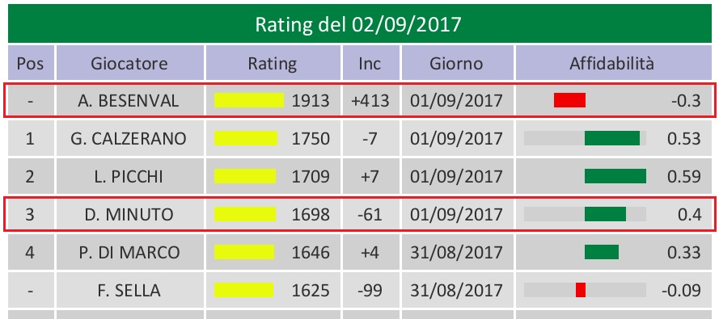

# Andy Rating System

## Overview

The Andy rating system was designed for the [AndyScorer](http://snooker.andyscorer.org) web service to evaluate players skills in the game of [snooker](en.wikipedia.org/wiki/Snooker). 
It is based on [Glicko](http://www.glicko.net/glicko.html) rating system with minor modifications and views players strength as their ability to win individual frames.

In our model, like in glicko, player skills are assumed to be [normally distributed random variables](https://en.wikipedia.org/wiki/Normal_distribution).
Parameters of the distributions (mean and variance) are reestimated periodically based on games outcomes.

The model relies on the following assumptions:
* players try to win every frame,
* frames outcomes are independent of each other.

Only *count of frames* won or lost determines the resulting ratings.
Any other factors, such as match outcome, points scored, breaks made, tournament stage etc, are not taken into account.

## Description

To each player two numbers are assigned:

* **Rating**.
Represents player's strength (ability to win frames).
Initial rating for a new player is 1500.

* **Reliability** (rescaled version of variance).
An auxiliary parameter that represents the system's confidence in player rating estimate.
Reliability varies from -1 (default for new players) to 1. 
The higher the reliability is, the more accurate the rating is considered to be. 
(Reliability 1 would mean that the system is 100% sure in player's strength, although this level of confidence can never be achieved.)
Reliability serves as an indicator for player [official status](#official).

Both numbers (rating and reliability) are updated *daily* based on all [ranked games](#games) played the day before.
The system estimates an expected outcome of each game and then simultaniously adjusts the ratings according to the difference between actual results and the expectations.
Updated ratings appear the *next day* after the games took place.
If player does not play ranked games, his rating value remains unchanged.

Reliability changes every day (regardless of player activity) in two alternative ways:
* Whenever ranked games are played, reliability grows (the increment depends on many factors).
That is, the more you play, the more trustworthy your rating is.
* When not playing, reliability decreases with the passage of time (by 0.008(3) every day), i.e. any absence period results in uncertanty.
Reliability drops to its minimum in no more than 2 years.

Roughly speaking, for every ranked frame players obtain or lose rating points.
The number of points depends on two factors:
1. *Difference between opponents ratings* prior to the game. 
This is the key factor: more "unexpected" outcomes result in bigger rating changes:

| Player A rating | Player B rating | Frame winner | Resulting rating change |
| :---------------: | :-----------------: | :-------: | :-----------------------: |
| High | Low | **A** (expected) | A gets few points, B loses few points |
| High | Low | **B** (unexpected) | A loses many point, B gets many points |

2. *Raliability*.
If raliability is high, rating changes will be small (because if the system is already confident in player skills, one frame will not give enough evidence for changing rating much).
On the contrary, low reliability leads to big volatility of the rating (information obtained from every frame will be perceptible compared to what the system already knows, thus it will try a bolder rating tuning).
Difference in the opponents reliabilities also plays some role.

### Remarks

* Rating changes depend on the *score*, not on a match result. Winning a match 3-0 or 3-2 makes an (essential) difference.

* Victory over a high rated player costs more than victory over a low rated player.
Similarly, loss to a low rated player costs more than loss to a high rated player.

* A low rated player may *earn* rating points, even when losing a match to a stronger opponent, if he manages to win few frames (the winner will lose rating points in that case).

* Rating changes for two opponents are *not symmetric* in general (but are always opposite).
They depend on opponents reliabilities: rating with lower reliability will vary more.

* Rating increments are *not additive*: number of points obtained for each frame in a series of games played the same day is slightly smaller than the number of points for a single frame alone.
Furthermore, when playing against many opponents the same day, the resulting rating change is composite of single frames, but not reduced to their sum.

* The system has *weak memory*: although all past games have some influence on the ratings, current ratings depend heavily on recent games and only slightly on games played long time ago.
(Assuming that players play regularly, of course. Ratings of players who stopped playing at all are frozen.)

### Types of games

There are three types of games, depending on their importance and effect on ratings:

* **Major ranking** games have full impact on ratings. 
It is assumed that the result of such game is important and thus both opponents do their best to win every frame. 
Most tournaments are major ranking.

* **Minor ranking** games have twice smaller effect on ratings than major ranking games.
All rating changes caused by minor ranking games are "discounted" by half. 
In other words, winning two *minor* frames have the same effect on ratings than winning one *major* frame.
Friendly matches as well as some small tournaments are minor ranking events. 
Under normal circumstances, it is recommended to give preference to this type of games, as long as players try to win.

* **Non ranking** games do not affect ratings at all. 
This type should be only used if players do not try to win or play not as they would normally do, so that the outcome does not adequately represent their real abilities.

### Guest players

Players that are not affiliated with an academy ("guests") are not ranked.
Games with such players are ignoged by the rating system.

### Frequecy restriction

If two players meet too often (more than once in *2 weeks*), their minor ranking games have smaller impact on ratings.
Namely, these games are counted with an additional "discount factor" equal to the inverse number of days played together within past 14 days.

For example, if two friends play with each other 3 days in a row, the games of the first day will be counted as normal minor ranking games.
The games played the second day will have twice smaller impact on ratings (coefficient 1/2).
Any games played between these two during the third day will be counted with coefficient 1/3, and so on.
If they meet again in two weeks or later, no penalty will be imposed any more, ranked game will be counted as usual.

All major ranking games have full impact on ratings, no matter how often they are played.

### Official status

Player's rating is said to be *official* if the reliability is positive, and *unofficial* otherwise.

This means that new players initially get unofficial ratings (default reliability is -1), and obtain official status only after they have played some number of games (typically around 20, enough for the rating to stabilize near its real value).

Since reliability of inactive players constantly decreases with the passage of time, ratings of those who do not play for a while sooner or later (but no more than in 120 days) become *unofficial*.
If that happens, they need to play certain number of gamse to confirm their level, before they can return their official status.

### Club ranking

Club official ranking is updated once a week based on Monday ratings.
Players whose rating is unofficial stay unranked.

## Probabilistic interpretation

Since the model under consideration is stochastic, knowing the ratings of two players it allows to estimate the *probability* for each of them to win a single frame and hence a match.
For example, between players whose ratings are 1700 and 1650 (provided they are equally reliable) the stronger player would win a frame with probability 62% and the distribution of possible outcomes for a match "best of 5 frames" would be:

Score | Probability
:--:|:--:
3-0 |18%
3-1 |24%
3-2 |20%
2-3 |16%
1-3 |14%
0-3 |8%

## Examples

#### Example 1. 
**A.B.** is a new player playing his first ever game. 
His initial rating is 1500 and the system knows nothing about his real strenghs yet (reliability -1). 
He wins a friendly (minor ranking) match 4-1 against **D.M.**, whose rating 1759 is more trustworthy (reliability 0.35). 
As the next day report reveals, **A.B.** gains +413 rating points, while **D.M.** only looses -61. 
Defeating a player with a fairly precise rating of 1759 is a reasonable evidence that **A.B.**'s strength is probably much higher than 1500. **D.M.**'s rating should decrease by a smaller amount, because his rating is already precisely measured to be near 1759, and he lost to a player whose rating cannot be trusted, therefore little information about **D.M.**'s playing strength has been learned from that match.
New reliabilities of the two players are -0.3 (unofficial) and 0.4, respectively.

#### Example 2.

**A.S.**'s rating is 1858 (reliability 0.48), **P.DM.**'s rating is 1684 and more reliable (0.7).
**A.S.** wins a major ranking match 3-2 (the only game both players had that day).
**A.S.**'s new rating is 1830 (-28), while **P.DM.**'s one is 1701 (+17).
Even though **A.S.** has won the match, the system thinks that the result 3-2 was closer then 1858 vs 1684, thus adds +17 points to **P.DM.** and subtracts 28 points from **A.S.** (notice that the less reliable rating changes more).
If it was a *minor* ranking game instead, the players would get twice less, +9 and -14 points, respectively.

## Web interface

AndyScorer website provides various detailed rating reports.
Chronological data in most reports are ordered from recent to past.

### Ratings
Ratings for a selected day (today by default)
\
with the following columns:
* *Position*. Please note that even though rounded rating values may sometimes coincide, the real values are almost surely different from each other, thus one position is never shared by more than one player.
* *Player name*.
* *Rating* for a given day (based on all games played before that day).
* Last rating *change* for each player.
* *Day* when the last ranking game was played. Notice that this date is always strictly before the day for which the ratings were generated, so games played on 11/12/2017 will only appear in the next day report for 12/12/2017 with the corresponding rating changes.
* Rating *reliability*.

Only official ratings are shown by default.
Set the corresponding flag to see all ratings including unofficial ones:

### Official ranking
Official club ranking (based on Monday ratings of the selected week, current week by default):
\
contains columns:
* *Position* (rank).
* *Position change* since the last week.
* *Player*.
* *Rating*.

Players whose rating is not official and who therefore are not ranked are listed in a separate table:

### Leaders
List of official ranking leaders for every week
\
and overall leaders by number of weeks holding the first plase

### Rating/ranking history
Record of all rating and ranking changes for a selected player:
\

## F.A.Q.

#### I have won the match. Why has my rating dropped?

Rating changes depend on the score (3-0 and 3-2 will have different effects), as well as on the players ratings prior to the game. 

Imagine your rating is 100, and Ronnie O'Sullivan's rating is 3000, and you lose 9-10. Evet though you lost the match, the system will conclude that probably you are not so bad and he is not so good, and adjust the ratings accordingly.

You are only guaranteed to get raning points if you:
* whitewash your opponent, or
* win (with any score) against a stronger opponent.

Otherwice make sure that you don't lose too many frames to rabbits.

#### When will I get an official rating?

When reliability of your rating becomes positive.
It usually takes about 20 frames to play with 5 different opponents, but precise number depents on the "quality" of you opponents, as well as some other factors.
Keep playing and you get your official status soon.

#### What happens to my rating if I don't play for some time?

Rating value itself will not change, but reliability will go down until eventually it hits 0 and then your rating becomes *unofficial*.
In that case you will need to play some number of games to return your official status.

#### Will I get additional rating points for winning a match / a deciding frame / a tournament?

No, the system only cares about frames on a scoreboard and treats them all equally (apart from major/minor type).
It does not distinguish deciding frames, tournament finals etc.
This is because we believe that, no matter how important game you win, the outcome depends on your skills very much like any other frame, rather that your will to win (unfortunately, we cannot measure players psychological state yet).
The only way to tell that one game is more important than another is to nominate it *major ranking*, not *minor ranking*, in which case rating changes will be simply twice bigger.

#### I regularly make big breaks and recently won a big tournament. Doesn't it mean I should be number one in ranking?

No, I doesn't. No matter how big breaks you make or what other achievements you have, as long as you don't win consistently your rating may be low.

## Credits
The rating system was inspired by *Gerardo Calzerano*, designed by *Anton Solomko* and implemented by *Anton Solomko* and *Luca Gherardi*.
