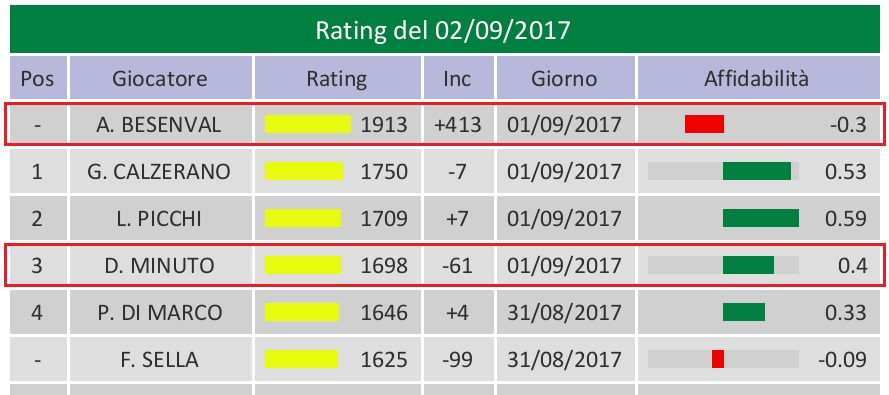

# Sistema di valutazione Andy

## Panoramica

Il sistema di valutazione Andy è stato progettato per [AndyScorer](http://snooker.andyscorer.org) per valutare le abilità di un giocatore nel gioco dello [snooker](https://it.wikipedia.org/wiki/Snooker). Questo sistema è basato sul sistema di valutazione [Glicko](http://www.glicko.net/glicko.html) con una serie di modifiche minori e mostra la forza dei giocatori come l'abilità di vincere individualmente i frames.

Nel nostro modello, come in Glicko, le abilità dei giocatori si presume che siano [variabili casuali normalmente distribuite](https://it.wikipedia.org/wiki/Distribuzione_normale). I parametri di distribuzione (media e varianza) sono nuovamente valutate periodicamente, in base ai risultati di gioco.

Il modello si basa sui seguenti presupposti:
* i giocatori cercano di vincere ogni frame,
* i frames siano indipendenti uno dall'altro.

Il solo *conteggio dei frames* (vinti o persi) determina il punteggio di valutazione.
Ogni altro fattore, come per esempio il risultato del match, i punti totalizzati, i breaks raggiunti, le fasi del torneo, non sono presi in considerazione.

## Descrizione

Per ogni giocatore sono assegnati due numeri:

* **Punteggio**.
Rappresenta la forza del giocatore (abilità di vincere frames). 
Il valore iniziale di forza del giocatore è di 1500 punti.

* **Affidabilità** del punteggio di valutazione del giocatore (versione rigraduata della varianza). 
Un parametro ausiliario che rappresenta la confidenza del sistema con il punteggio del giocatore stabilito. 
L'affidabilità varia da -1 (Standard per i nuovi giocatori) a 1. 
Maggiore è l'affidabilità, maggiore è il punteggio. 
(Affidabilità 1 significa che il sistema è sicuro al 100% della forza del giocatore, sebbene questo livello di confidenza non potrà mai esser raggiunto.) 
L'affidabilità serve come indicatore per lo [stato ufficiale](#official) del giocatore.

Entrambi i numeri (punteggio ed affidabilità) sono aggiornati *giornalmente* in base alla totalità delle [partite classificate](#games) giocate nelle giornate precedenti. 
Il sistema stima un risultato previsto per ogni partita e poi, simultaneamente, corregge il punteggio in base alla differenza tra il risultato ottenuto e la previsione. 
I risultati aggiornati vengono mostrati il *giorno seguente*, dopo che le partite sono state giocate. 
Se il giocatore non gioca partite classificate, il suo punteggio rimane invariato.

L'affidabilità cambia ogni giorno (indipendentemente dall'attività del giocatore) in due modi differenti:
* Ogni volta che una partita classificata viene giocata, l'affidabilità *cresce*; il che significa che più giochi, più credibile è il tuo punteggio. L'incremento dipende da vari fattori.
* Quando non si gioca, l'affidabilità *diminuisce* col passare del tempo (di 0.008(3) ogni giorno). Nei fatti ogni periodo di inattività determina una maggiore incertezza sulle abilità di un giocatore. 
Se un giocatore smette completamente di giocare, l'affidabilità cala fino a raggiungere il punteggio minimo (-1) in circa 2 anni.

Per ogni frame in una partita classificata, il giocatore ottiene o perde dei punti.
Il numero di punti dipende da due fattori:
1. *Differenza tra le valutazioni degli avversari* precedenti alla partita.
Questo è il fattore chiave: più il risultato ottenuto è inaspettato dal sistema, più il punteggio varia:

| Punteggio giocatore A | Punteggio giocatore B | Vincitore frame       | Variazione del punteggio                |
| :-------------: | :-------------: | :----------------: | :------------------------------------: |
| Alto            | Basso             | **A** (previsto)   | A riceve pochi punti, B perde pochi punti  |
| Alto            | Basso             | **B** (non previsto) | A perde molti punti, B riceve molti punti |

2. *Affidabilità*.
Se l'affidabilità è elevata, il cambiamento nel punteggio sarà di poco conto (dato che il sistema è già confidente nelle abilità del giocatore, un frame non fornirà una dimostrazione abbastanza valida per modificare fortemente il punteggio). 
Al contrario, una bassa affidabilità comporterà una possibilità di variazione del punteggio elevata (Le informazioni ottenute da ogni frame saranno percepibili rispetto a quelle che il sistema già conosce, quindi proverà ad una regolazione più audace del punteggio). 
La differenza nell'affidabilità tra i vari giocatori ha la sua importanza.

### Caratteristiche chiave

* Il cambiamento del punteggio deriva dai *punti di gioco*, non dal risultato della partita. 
Vincere un incontro 3-0 o 3-2 è assolutamente ininfluente.

* Vincere contro un giocatore con un punteggio elevato permette di ottenere molti più punti, inversamente, vincere contro un giocatore con un punteggio basso vi farà ottenere pochi punti.

* Un giocatore con basso punteggio potrebbe *ottenere* dei punti persino quando perde un incontro contro un giocatore più forte se riesce a vincere qualche frame (il vincitore perderà qualche punto, in questo caso). 
Per esempio, giocando contro uno sfidante forte, un giocatore potrebbe perdere -5 punti per ogni frame perso e guadagnarne +23 per un frame vinto; quindi una partita persa 1-3 darà al giocatore sconfitto 23 – 3*5 = +8 punti.

* I cambiamenti di punteggio dei giocatori *non sono simmetrici* in genere (ma sempre opposte). Dipendono dall'affidabilità degli sfidanti: i punteggi con affidabilità bassa variano di più.

* Gli incrementi dei punteggi *non sono aggiuntivi*: i punti ottenuti nei vari frames in una serie di partite giocata lo stesso giorno è leggermente inferiore al numero di punti ottenuti per un frame singolo. 
Inoltre, quando si gioca contro vari giocatori nello stesso giorno, la variazione di punteggio è composta dai singoli frames, ma non ridotta alla loro somma aritmetica.

* Il sistema ha la *memoria corta*. Sebbene tutte le partite passate abbiano una certa influenza sul sistema di punteggio, il punteggio attuale dipende fortemente dalle partite più recenti e solo in parte dalle partite giocate tempo prima. 
(Dando per scontato che i giocatori giochino regolarmente, naturalmente. I giocatori che hanno smesso di giocare vengono congelati.)

### Tipologie di gioco

Ci sono tre tipi di gioco, catalogati in base alla loro importanza ed influenza sul sistema di calcolo del punteggio:

* **Major (principale) ranking** hanno un impatto pieno sul sistema di calcolo del punteggio. 
Si da per scontato che questa tipologia di partite sia considerata importante per entrambi gli sfidanti che faranno del loro meglio per vincere ogni frame. La maggior parte dei tornei sono partite classificate principali.

* **Minor (secondario) ranking**: hanno un impatto parziale messe a confronto con le partite classificate principali. 
Qualsiasi variazione causata da una partita classificata secondaria è “ammortizzata” o “scontata” di metà del suo valore.
In altre parole vincere due frames *secondario* è come vincere un frame *principale*. 
Le sfide amichevoli come anche i piccoli tornei sono classificate come eventi secondari. 
Sotto normali circostanze è consigliato giocare questa tipologia di partite fino a quando i giocatori cercheranno di vincere.

* **Non (nessun) ranking**: non variano il punteggio in alcun modo. 
Questa tipologia di partite dovrebbe esser giocata quando i giocatori non giocano per vincere oppure quando i giocatori non giocano come farebbero normalmente e quindi non ottengano il risultato che avrebbe rappresentato le loro abilità reali di gioco.

### Ospiti

I giocatori che non sono affiliati ad un'accademia (“ospiti”) non sono classificati. Ogni incontro che vede tra gli sfidanti un ospite è ignorato dal sistema.

### Restrizione di frequenza

Se due giocatori si incontrano troppo spesso (più di una volta in 2 settimane), le loro partite classificate secondarie (minor ranking) hanno un impatto minore sulla variazione del punteggio. In pratica a queste partite è attribuito un ulteriore "ammortamento" uguale al numero inverso di giorni in cui hanno giocato insieme negli ultimi 14 giorni.

Ad esempio, se due amici si sfidano per 3 giorni di fila, le sfide del primo giorno verranno contate come partite classificate secondarie normali. Le partite giocate il secondo giorno subiranno un impatto che equivale alla metà dell’impatto normale sui punteggi (coefficiente 1/2 o 1/4 rispetto a una partita classificata principale). Qualsiasi partita giocata tra questi due durante il terzo giorno verrà conteggiata con il coefficiente 1/3 e così via. Se si incontrano di nuovo tra due settimane o più tardi, non verrà più imposta alcuna penalità di frequenza e il gioco classificato verrà conteggiato come al solito.

Tutti i frame giocati in partite principali (major ranking) non subiscono questo ammortamento e hanno un impatto completo sui rating, indipendentemente dalla frequenza con i quali vengono giocati.

### Stato ufficiale

La valutazione del giocatore è **ufficiale** se l'affidabilità è positiva e **non ufficiale** altrimenti.

Ciò significa che i nuovi giocatori ottengono inizialmente valutazioni non ufficiali (l'affidabilità predefinita è -1) e ottengono lo status ufficiale solo dopo aver completato un certo numero di partite classificate (in genere circa 20 frames giocati contro 5 avversari diversi, sufficienti perché il punteggio si stabilizzi vicino al valore reale).

Poiché l'affidabilità dei giocatori inattivi diminuisce costantemente con il passare del tempo, i punteggi di quei giocatori, che non giocano per un po', prima o poi (ma non più di 120 giorni) diventano *non ufficiali*. 
Se ciò accade, devono giocare un certo numero di partite per confermare il loro livello, prima che ritornino al loro stato ufficiale.

### Classifica del club

La classifica ufficiale del club viene aggiornata una volta alla settimana e si basa sulle valutazioni del lunedì. 
I giocatori la cui valutazione non è ufficiale rimangono non classificati.

## Interpretazione probabilistica

Il nostro modello è stocastico: dai risultati delle varie partite cerca di stimare entità e varianze delle abilità dei giocatori distribuite normalmente. In secondo luogo consente di prevedere i risultati delle sfide future. 
Conoscendo le valutazioni di due avversari, si può stimare la *probabilità* per ognuno di loro di vincere un singolo frame, e di conseguenza una partita. Ad esempio, per due giocatori con punteggi 1700 e 1650 (a condizione che siano ugualmente affidabili), il più forte vincerebbe un frame con probabilità 62% e la distribuzione dei possibili risultati di una partita "al meglio dei 5 frame" sarebbe:

Punteggio | Probabilità
:----:|:-----------:
 3-0  | 18%
 3-1  | 24%
 3-2  | 20%
 2-3  | 16%
 1-3  | 14%
 0-3  | 8%

## Esempi

#### Example 1.
**A.B.** è un nuovo giocatore che gioca la sua prima partita in assoluto. 
Il suo punteggio iniziale è 1500 e il sistema non sa ancora nulla dei suoi veri punti di forza (affidabilità -1). 
Vince una partita secondaria (minor ranking) 4-1 contro **D.M.**, la cui valutazione di 1759 punti è più affidabile (affidabilità 0,35). Come rivela il rapporto del giorno dopo, **A.B.** guadagna +413 punti di valutazione, mentre **D.M.** ne perde solo -61. 
Sconfiggere un giocatore con un punteggio abbastanza preciso di 1759 è una prova ragionevole del fatto che la forza di **A.B.** è probabilmente molto più alta di 1500. 
Il punteggio di **D.M.** dovrebbe diminuire di un importo inferiore perché il suo punteggio è già stato misurato con precisione per 1759 punti e perchè ha perso contro un giocatore il cui punteggio non può essere considerato attendibile, date le poche informazioni sulla forza di gioco di **D.M.** che sono state apprese dal sistema finora. 
Le nuove affidabilità dei due giocatori sono rispettivamente di -0,3 (non ufficiale) e 0,4.

#### Example 2.
La valutazione di **A.S.** è 1858 (affidabilità 0,48) mentre la valutazione di **P.DM.** è 1684 ed più affidabile (0,7). 
**A.S.** vince una partita principale (major ranking) 3-2 (l'unica partita che entrambi i giocatori hanno fatto in quella giornata). 
Il nuovo rating di **A.S.** è 1830 (-28), mentre quello di **P.DM.** è 1701 (+17). 
Anche se **A.S.** ha vinto la partita, il sistema pensa che il risultato 3-2 fosse più vicino di 1858 contro 1684, quindi aggiunge +17 punti a **P.DM.** e sottrae 28 punti da **A.S.** (da notare che la valutazione meno è affidabile più è soggetta a variazioni). 
Se invece si fosse trattato di una partita classificata secondaria, i giocatori ottenevano la metà del punteggio, quindi, rispettivamente, +9 e -14 punti.

## Web Reports

L’applicazione web di [AndyScorer](http://snooker.andyscorer.org) fornisce vari report di valutazione. 
I dati cronologici vengono generalmente ordinati dal recente al passato.

### Le valutazioni
\
Questa tabella mostra le valutazioni per un giorno selezionato (di default la data impostata è quella odierna) con le seguenti colonne:
* *Posizione*. Si tenga presente che una posizione non viene mai condivisa da due giocatori, anche se talvolta le valutazioni arrotondate coincidono. I valori reali (non arrotondati) sono quasi sicuramente diversi l'uno dall'altro.
* *Nome* del giocatore.
* *Valutazione* per un dato giorno (basato su tutte le partite giocate in precedenza).
* Ultimo *cambio* di valutazione per ogni giocatore.
* *Giorno* in cui è stata giocata l'ultima partita di classificata.
* *Affidabilità* di valutazione.

Solo le valutazioni ufficiali sono mostrate in maniera predefinita. 
Nel caso in cui si vogliano visualizzare anche le valutazioni non ufficiali si deve spuntare la bandiera corrispondente:

### Classifica ufficiale
\
La classifica ufficiale del club (in base alle valutazioni del lunedì della settimana selezionata, la settimana visualizzata di default è quella corrente) contiene le seguenti colonne:
* *Posizione* (classifica).
* *Cambio di posizione* in classifica dall'ultima settimana.
* *Giocatore*.
* *Punteggio*.

I giocatori la cui valutazione non è ufficiale e che, quindi, non sono classificati sono elencati in una tabella separata:

### Leaders
Questo blocco contiene due tabelle:
* La lista dei giocatori che hanno ottenuto il primo posto nella classifica settimanale,
* La lista dei giocatori che hanno detenuto il primo posto nella classifica più a lungo.

### Cronologia della valutazione/classifica
Il resoconto di tutte le valutazioni e delle variazioni della posizione in classifica per un dato giocatore:
\

## F.A.Q. - Domande fatte di frequente

#### Ho vinto la partita. Perché la mia valutazione è scesa?

Le variazioni di punteggio dipendono dal punteggio (3-0 e 3-2 avranno effetti diversi), così come dalle valutazioni dei giocatori prima della partita.

Immagina che la tua valutazione sia 100, e la valutazione di Ronnie O'Sullivan è 3000, e perdi 9-10. Anche se hai perso la partita, il sistema concluderà che probabilmente non sei così male e lui non è così bravo, e aggiusta le valutazioni di conseguenza.

Avrete la garanzia di ottenere punti di valutazione solo se:
* Battete il vostro avversario senza fargli vincere nemmeno un frame.
*	Vincete contro un avversario più forte.

Altrimenti assicuratevi di non perdere troppi frames contro gli avversari più deboli.

#### Quando riceverò una valutazione ufficiale?

Quando l'affidabilità della tua valutazione diventa positiva. 
Di solito ci vogliono circa 20 frames giocati contro 5 avversari diversi, ma il numero preciso dipende dalla "qualità" dei tuoi avversari, così come da altri fattori. 
Continua a giocare e avrai presto il tuo status ufficiale.

#### Cosa succede alla mia valutazione se non gioco per un po 'di tempo?

Il valore di valutazione in sé non cambierà, ma l'affidabilità diminuirà fino a quando non raggiungerà lo 0 e quindi il tuo punteggio diverrà *non ufficiale*. 
In tal caso dovrai giocare un certo numero di partite per riottenere il tuo stato ufficiale.

#### Riceverò punti aggiuntivi per la vittoria di una partita / un frame decisivo / un torneo?

No, al sistema interessano solo i frame che vengono trattati tutti allo stesso modo (a parte la tipologia principale / secondaria). Non fa distinzione tra frames decisivi, finali di torneo ecc. Questo perché crediamo che, indipendentemente da quanto sia importante la partita, il risultato dipende dalle tue abilità come qualsiasi altro frame, piuttosto che dalla tua volontà di vincere (sfortunatamente, non possiamo misurare lo stato psicologico dei giocatori, ancora). L'unico modo per dire che una partita è più importante di un'altra è nominarla classifica *principale (major ranking)* e *non (minor ranking)*. In questo caso le modifiche alla valutazione saranno, semplicemente, doppie.

#### Faccio regolarmente breaks molto elevati e, di recente, ho vinto un grande torneo. Non significa che dovrei essere il numero uno in classifica?

No, non è così. Non importa quanto elevati siano i frames che fai o quali altri traguardi hai, finché non vinci in maniera costante il tuo punteggio potrebbe essere comunque basso.

## Ringraziamenti
Il sistema di valutazione è stato ispirato da *Gerardo Calzerano*, progettato da *Anton Solomko* e realizzato da *Anton Solomko* e *Luca Gherardi*. Ringrazio *Andrea Camplani* per la traduzione di queste informazioni.
